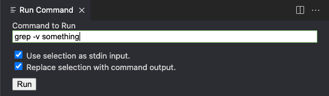

# Run Command VSCode Extension
This extension allows you to run any shell command on the selected text.

## Features
- Run a command with stdin being the selected test and either:
	- Replace the selection with the output.
	- Show the output.

## Example Usage

## Useful Commands
- `grep term` - Remove all lines from the selection that don’t include `term`.
- `grep -v term` - Remove all lines from the selection that include `term`.

## Warning!
**Because this extension will run whatever command you enter, be careful with what command you run and do not blindly paste commands from others.**
